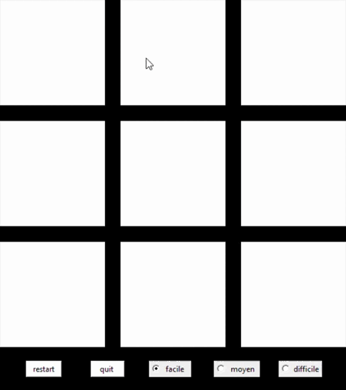
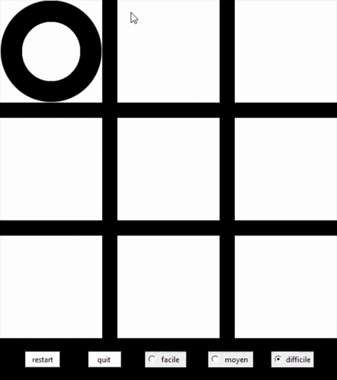

# Morpion-avec-IA

## Introduction
- Projet réalisé en terminale pour le cours de NSI 
- codé avec python 
- librairies utilisées : tkinter, time 

## Présentation

- Le but est de faire un morpion avec la librairie tkinter et une inteligence artificielle avec plusieurs niveaux de difficultés 

## Visuel

- Facile

- Moyen

- Difficile

## Comment intaller le jeu

- Installer tous les fichiers
- Installer la librairie pygame et lancer le fichier jeu.py
