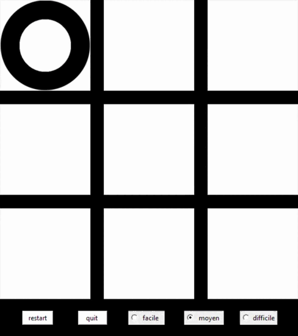

# Morpion-avec-IA

## Introduction
- Projet realise pour le cours de NSI 
- codé avec python 
- librairie utilisée : tkinter, time 

## Presentation

- Le but etais de faire un morpion avec la librairie tkinter et une inteligence artificielle qui a plusieurs niveaux de dificulter 

## Visuel

- Facile

- Moyen

- Difficile

## Comment intaller 

- Installer tout les fichiers
- Installer la libraire pygame et lancer le ficher jeu.py
